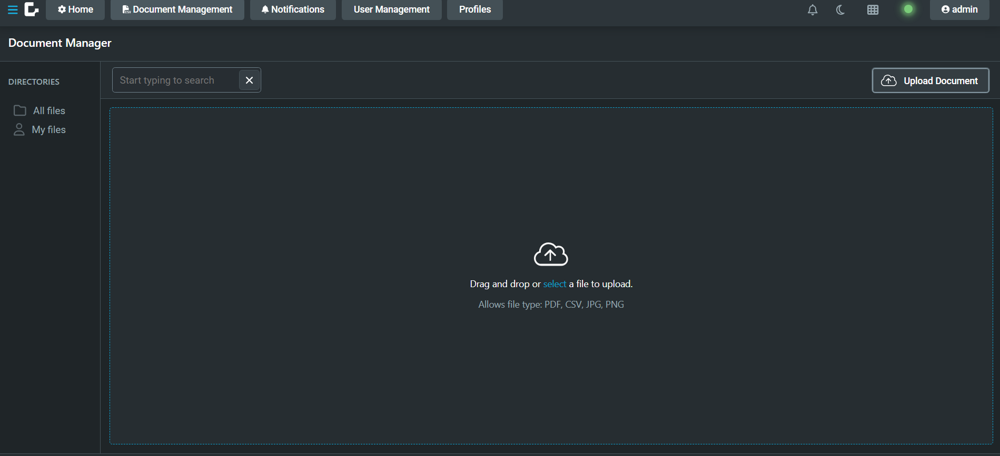
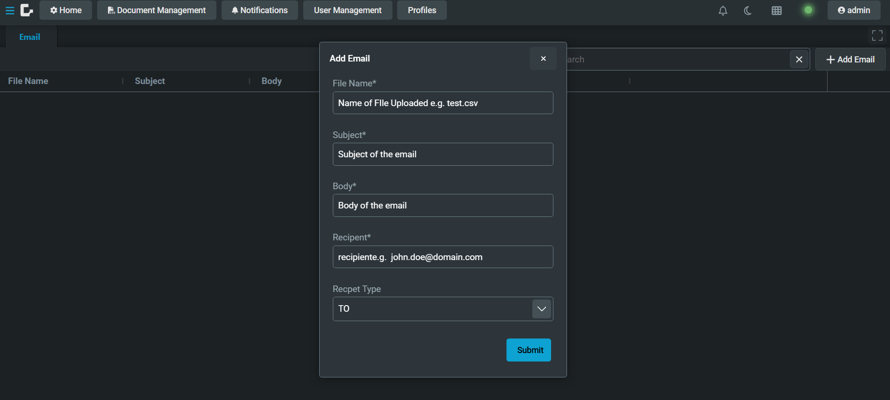

# How To Send An Email With An Attachment

This application has been designed to demonstrate how Genesis components can be used to send an email with an attachment.

To do this, there are three main steps (further details for each step have been provided in the "Running the application" section of this file):

1. Upload a file using the Document Management tab - this is the file that will be attached to the email.
2. Fill in a form through the UI with the details of the email you would like to send - this will include the email recipient, the content of the body etc.
3. Submitting the form in step 2 triggers `EVENT_EMAIL_INSERT` which sends the email before inserting these details into the `EMAIL` table.

The aforementioned `EMAIL` table has been created simply to store the details of the email that the user wishes to send - it should be noted that this table is not required to send emails with attachments, 
all logic pertaining to the email service lives in the event handler as explained below. However, all relevant details would need to be provided to the event handler in some other way - for example, this can be done through system
definitions. An example of this has been provided in the event handler mentioned in the "Create event" section of this document.

See [Notify - Email](https://docs.genesis.global/docs/develop/business-components/notifications/notifications-server/email/) for more information on sending emails.

Although this application is demonstrating the email attachment capability of Notify, the component also allows you to use a pre-uploaded template to format the body of your email.
See [Notify - Templated Notification Bodies](https://docs.genesis.global/docs/develop/business-components/notifications/notifications-server/templated-notification-bodies/) for more information on templating within email bodies.

# Pre-requisites

## Add Components

In order to use this feature, ensure that the following components have been added to your application.
- Document Management
- Notifications

It is advised to generate your application using Genesis Create and select the aforementioned components in the "Add Genesis Components" section.
If you have already created your application, see the following pages to install these using GenX:
- [Install Document Management](https://docs.genesis.global/docs/develop/business-components/doc-management/doc-management-installation/)
- [Install Notifications](https://docs.genesis.global/docs/develop/business-components/notifications/notifications-installation/)

## Add dependency to API modules of components

Asides from the components, there are two additional dependencies that need to be added to [build.gradle.kts](server/howto-send-email-with-attachment-app/build.gradle.kts).

```kotlin
implementation("global.genesis:genesis-notify-api:${properties["notifyVersion"]}")
implementation("global.genesis:file-server-api:${project.ext["fileServerVersion"]}")
```

- `genesis-notify-api`: allows us to interact with the service that sends out emails
- `file-server-api`: allows us to interact with the document management client to retrieve the uploaded file

Ensure that the version here matches that of the main component dependency, see [gradle.properties](server/gradle.properties) to confirm the property name matches.


## Update processes definition

Alongside updating the gradle dependency, we must add `global.genesis.notify.api.service` and `global.genesis.file.api` to the process definition that our application will be using. 
See how this is done in [howto-send-email-with-attachment-processes.xml](./server/howto-send-email-with-attachment-app/src/main/genesis/cfg/howto-send-email-with-attachment-processes.xml).

## Mail Server

In order to send and receive emails, the details of your mail server must be configured in [genesis-notify.kts](./server/howto-send-email-with-attachment-app/src/main/genesis/scripts/genesis-notify.kts). 
As it is, this file is for illustrative purposes only and will not allow emails to be sent. Please ensure the file is updated with the relevant details before attempting to send emails.

## Create event

See [eventhandler.kts](./server/howto-send-email-with-attachment-app/src/main/genesis/scripts/howto-send-email-with-attachment-eventhandler.kts) for all the logic required to send the email.

# Running this application

Once your mail server is running and the relevant configuration has been added, we can start up our application and follow the steps required to send out the email.

## Step 1 - Uploading a file

In order to be able to attach a file to the email, the file needs to be uploaded to the Document Management component. To do this, click on the Documents Manager tab and upload a file as shown below.



This will upload the file and can therefore be referenced by file name when creating the email in order to add it as an attachment.

## Step 2 - Fill in the form

Now that the file has been uploaded, we can go back to the home tab to fill in the form. At the top navigate to the "Home" tab and click on the
"+ Add Email" button on the top right. A form will pop up as shown below:



Note: the File Name is what will be used to find the file to be attached from the document manager. 
Ensure that this file name matches exactly what has been uploaded otherwise the file will not be found and this event will fail.

By submitting this form, the `EVENT_EMAIL_INSERT` is triggered and a new record is added to the `EMAIL` table. The EMAIL table simply contains the fields required to
send an email and thus stores all emails that have been sent. 
 
You can see more on the EMAIL table in the [tables-dictionary.kts](./server/howto-send-email-with-attachment-app/src/main/genesis/cfg/howto-send-email-with-attachment-tables-dictionary.kts) file.

## Step 3 - An email is created and sent

As mentioned above, the `EVENT_EMAIL_INSERT` has now been triggered, see [eventhandler.kts](./server/howto-send-email-with-attachment-app/src/main/genesis/scripts/howto-send-email-with-attachment-eventhandler.kts).

In summary, the event reads the details submitted through the form and uses the `FileStorageClient` to find the file pto attach.
It then uses the `NotificationService` to create the email notification. We set the recipients,
attachments, subject and body then send it using the mail server. 

Remember, we need the email server running, so make sure to go through the [pre-requisites](#pre-requisites). 

Take a look at the comments inside the [event handler](./server/howto-send-email-with-attachment-app/src/main/genesis/scripts/howto-send-email-with-attachment-eventhandler.kts) for a more indepth view.

# Real World Application

As stated above, this application only stores details regarding the email that the user has sent. In a real world application, these details may already have been provided in the system definition file
and as such can be directly accessed from the event itself rather than needing to be provided from the UI.

A potential example is having an email confirmation sent to traders when a new trade is created or multiple trades have gone through an order management pipeline. The event could receive the new trade object(s) and 
send an email using the details configured in their system definition file. A file could be created via the [Document Generator component]((https://docs.genesis.global/docs/develop/business-components/generated-docs/generated-docs-server/#a-document-generator-in-an-event-handler)) 
where the newly inserted data is embedded into a pre-uploaded template file and subsequently attached to the email.

# License

This is free and unencumbered software released into the public domain. For full terms, see [LICENSE](./LICENSE)

**NOTE** This project uses licensed components listed in the next section, thus licenses for those components are required during development.

## Licensed components
Genesis low-code platform
# Test results
BDD test results can be found [here](https://genesiscommunitysuccess.github.io/howto-send-email-with-attachment/test-results)
